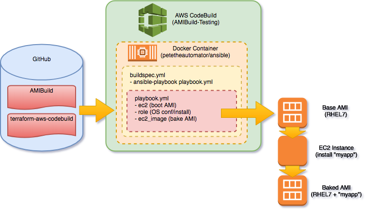

AMIBuild
========

POC pipeline for AMI building/baking


Description
-----------

This project automates the creation of a Continuous Delivery pipeline for "baking" AWS AMIs.  It uses Terraform to provision an AWS CodeBuild Project, in order to execute Ansible playbooks/roles which provision an EC2 instance and carry-out OS configuration & software installations for baking into an AMI appliance.  The advantage of using CodeBuild is it provides a consistent execution workflow and all at reduced costs - resources are required only for the duration of the build.



Prerequisites
-------------

AWS CodeBuild must be run in a VPC Subnet with a NAT Gateway as mentioned in the "Best Practices for VPCs" section in [this document](https://docs.aws.amazon.com/codebuild/latest/userguide/vpc-support.html#best-practices-for-vpcs)  A detailed guide to configuring a suitable Subnet, NAT Gateway and Routing can be found [here](https://docs.aws.amazon.com/AmazonVPC/latest/UserGuide//VPC_Scenario2.html).


CodeBuild
---------

A CodeBuild project is created using Terraform, which can be provisioned using the following commands...

```
cd terraform
terraform init
terraform apply
```

Docker
------

A Docker image with Ansible is required for provisioning the EC2 instance to bake, carrying out any software installation and OS configuration on it, and then to stop & snapshot the AMI.  The docker image can be build using these commands...

```
cd docker
docker build -t petetheautomator/ansible
docker push petetheautomator/ansible
```


Building an AMI
---------------

Locate the "AMIBuild-Testing" CodeBuild project in the AWS Console and build from there, or you can use awscli like so...

```
aws codebuild start-build --project-name AMIBuild-Testing
```

